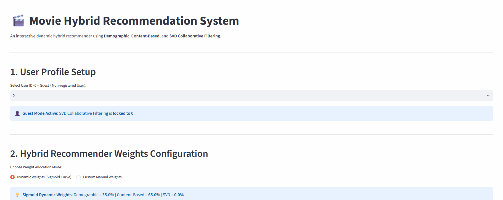

# Dynamic Hybrid Movie Recommender System

## Overview
This project is an interactive **Dynamic Hybrid Movie Recommender System** built with **Streamlit**, **Surprise**, and **Scikit-learn**. It combines three distinct recommendation approaches into a single weighted pipeline:

* **Demographic Filtering:** Recommends popular, high-rated movies based on the IMDb weighted rating formula.

* **Content-Based Filtering:** Calculates multi-feature cosine similarity across film metadata (genres, keywords, collection, director, screenplay, and cast).

* **Collaborative Filtering (SVD)：** Predicts personalized user ratings using Matrix Factorization via Singular Value Decomposition.


> For in-depth details for Exploratory Data Analysis (EDA), Model Selection and Tuning, and Results, please refer to the [Full Technical Report](movie_recommendation_report.md).

---

## Demo



**Try the Live Interactive Web App:** [... on Streamlit Cloud](https://dynamic-hybrid-movie-recommender-system-a9f86gwfzfhyf4jfbtnlzq.streamlit.app)

---

## Key Features & Highlights

Key Features
Dynamic & Custom Weighting: Dynamically balances hybrid model weights using a Sigmoid curve based on user activity, or allows manual slider control down to pure single-model filtering.

Cold-Start / Guest Handling: Automatic guest mode (User ID = 0) that locks collaborative filtering to zero and relies on demographic and content signals.

Sub-Module Fine-Tuning: Fine-grained weight controls for individual metadata features within the content-based engine.

Real-Time Interactive UI: Single-page Streamlit interface optimized with @st.fragment state management for zero UI jittering and persistent result rendering.


---
## Key Results  

### 1. Model Performance Comparison


### 2. Champion Model Deep-Dive


### 3. Feature Importance & Model Interpretability


---

## Tech Stack

* **Language:** Python `3.12.11`
* **Data Processing & Analysis:** Pandas, NumPy
* **Machine Learning:** Scikit-Learn, lightgbm
* **Visualization:** Matplotlib, Seaborn, statsmodels
* **Model Interpretability :** shap
* **Model Persistence:** Joblib
* **Web Framework:** Streamlit

---

## Project Structure

```text
bulldozers-price-predictor/
├── assets/
│   └── demo.gif                        # Demonstration GIF for README
├── data/                               # Data set
├── bulldozers_price_regression.ipynb   # Complete Machine Learning pipeline
├── bulldozers_price_report.md          # Comprehensive technical report
├── app.py                              # Interactive Streamlit web application
├── requirements.txt                    # Python dependencies
└── README.md                           # Project documentation
```

The execution pipeline automatically generates and manages the following runtime directories:

```text
├── models/                             # Stores trained model files
└── plots/                              # Generated visualizations
    ├── EDA/                            # Exploratory Data Analysis plots
    ├── Model_Selection/                # Hyperparameter tuning and Evaluation Metrics
    └── Features/                       # Feature importance visualizations
```

---

## How to Run

First clone the repository:
```bash
git clone https://github.com/BevisWong76/bulldozers-price-predictor.git
cd bulldozers-price-predictor
```

You can then set up the project locally using either the standard Python `venv` or the ultra-fast `uv` package manager.

### Option 1: Using Standard Python `venv` (Traditional)

1. Create a virtual environment:
```bash
python -m venv .venv
```

2. Activate the virtual environment:
```bash
# Windows (Command Prompt):
.venv\Scripts\activate.bat

# Windows (PowerShell):
.venv\Scripts\Activate.ps1

# macOS / Linux:
source .venv/bin/activate
```

3. Install dependencies:
```bash
pip install --upgrade pip
pip install -r requirements.txt
```

### Option 2: Using `uv` (Recommended for Speed)

`uv` is an extremely fast Python package installer and resolver written in Rust.

1. Install `uv` (if you haven't already):
```bash
pip install uv
```

2.  Create a virtual environment:

```bash
uv venv
```

3. Activate the virtual environment:
```bash
# Windows (Command Prompt):
.venv\Scripts\activate.bat

# Windows (PowerShell):
.venv\Scripts\Activate.ps1

# macOS / Linux:
source .venv/bin/activate
```

 4. Install dependencies:
```bash
uv pip install --upgrade pip
uv pip install -r requirements.txt
```

### Run the Streamlit App

Once the dependencies are installed and the model artifacts are generated, launch the interactive web application:

```bash
streamlit run app.py
```
---

## Acknowledgements

* **Dataset:** 
* **Inspiration:** 

### Key Enhancements Beyond Baseline
* **Robust Pipeline Architecture:** 
* **Advanced Benchmarking & Tuning:**
* **Model Interpretability:** 
* **Interactive Web App:**