# Comprehensive Technical Report: Dynamic Hybrid Movie Recommendation System

## Table of Contents
1. [Problem Definition](#1-problem-definition)
2. [Data Preprocessing & Exploratory Data Analysis (EDA)](#2-data-preprocessing--exploratory-data-analysis-eda)
3. [Demographic Filtering Engine](#3-demographic-filtering-engine)
4. [Content-Based Recommendation Engine](#4-content-based-recommendation-engine)
5. [Collaborative Filtering Engine (SVD)](#5-collaborative-filtering-engine-svd)
6. [SVD Model Insights](#6-svd-model-insights)
7. [Interactive Web Application & Hybrid Deployment](#7-interactive-web-application--hybrid-deployment)
8. [Conclusion](#8-conclusion)
9. [Acknowledgments](#9-acknowledgments)

---

## 1. Problem Definition

### 1.1 Problem Statement
Modern streaming platforms host tens of thousands of media titles, creating an information overload problem for users seeking content relevant to their tastes. Recommender systems aim to alleviate this friction by filtering candidate items down to a personalized Top-N shortlist.

However, standalone recommendation engines face well-documented failure modes:
1. **Cold-Start Problem:** Collaborative filtering algorithms fail for new users (zero rating history) or newly listed items without interaction logs.
2. **Sparsity & Popularity Bias:** User-item interaction matrices are inherently sparse (>99% missing values), causing raw popularity metrics to over-represent a small subset of mainstream movies.
3. **Static Weight Allocation:** Fixed-weight hybrid systems fail to adapt dynamically as a user transitions from a novice/guest state to an active platform user with rich rating history.

The goal of this project is to architect a dynamic, interactive hybrid recommender system that seamlessly blends demographic, content-based, and collaborative filtering signals to deliver highly relevant content across all user lifecycle stages.

### 1.2 Machine Learning Formulation
This project formulates recommendation generation as a multi-stage candidate scoring and dynamic hybrid ensemble task.

Given a target user *u* with *Nu* explicit ratings in the system and an input set of liked seed movies *M*input, the system computes a composite final score *S*final(*u*, *i*) for candidate movie *i*:

$$S_{\text{final}}(u, i) = w_{\text{demo}}(N_u) \cdot \hat{S}_{\text{demo}}(i) + w_{\text{content}}(N_u) \cdot \hat{S}_{\text{content}}(i, M_{\text{input}}) + w_{\text{svd}}(N_u) \cdot \hat{S}_{\text{svd}}(u, i)$$

Where:
* **Demographic Engine ($\hat{S}_{\text{demo}}$):** Scores movies globally using an IMDb Bayesian Weighted Rating formula to establish a high-quality baseline.

* **Content-Based Engine ($\hat{S}_{\text{content}}$):** Calculates multi-feature cosine similarity across engineered metadata vectors (TF-IDF for summaries/keywords; Count Vectorization for cast, director, screenplay, collections, and genres).

* **Collaborative Filtering Engine ($\hat{S}_{\text{svd}}$):** Employs Singular Value Decomposition (SVD) matrix factorization to predict explicit ratings based on latent factor representations of users and items:
  $$\hat{r}_{u,i} = \mu + b_u + b_i + p_u^T q_i$$

* **Dynamic Weight Allocation** ( $w(N_u)$ ): A Sigmoid function dynamically adjusts model weights based on user interaction density ($N_u$). For guest users ($N_u = 0$), $w_{\text{svd}}$ is locked to 0. As $N_u$ increases, $w_{\text{svd}}$ non-linearly ramps up while shifting weight away from pure demographic baselines.

* **Score Normalization ($\hat{S}$):** Min-Max Scaling is applied across individual engine outputs prior to weighting to align distinct score distributions onto a uniform scale [0.0, 1.0].

### 1.3 Evaluation Metrics
To rigorously evaluate performance, metrics are split into model-specific accuracy, top-K ranking assessments, and feature-level similarity breakdowns:

1. **Rating Prediction Accuracy (Collaborative Filtering):**
   * **Root Mean Squared Error (RMSE):** Penalizes larger rating prediction errors heavily.
   * **Mean Absolute Error (MAE):** Measures average absolute deviation between predicted and actual ratings.

2. **Top-K Ranking & Retrieval Metrics (Held-out Test Set):**
   * **Precision@K:** Proportion of recommended items in the top-K list that are relevant to the user.
   * **Recall@K:** Proportion of all user-relevant items captured within the top-K recommendations.
   * **Hit Rate@K:** Binary indicator measuring whether at least one user-liked item appears within the top-K recommended items.

3. **Sub-Module Feature Analysis:** Feature-level cosine similarity breakdown matrices (keywords, genres, director, cast, etc.) to evaluate intra-item content alignment.

### 1.4 Data Source
The primary dataset used is **"The Movie Dataset"** sourced from Kaggle (collected from TMDB and GroupLens MovieLens API).

* **Metadata Scope:** ~45,000 movies released on or before July 2017.
* **Rating Interactions:** 100,000 explicit ratings (scale 0.5–5.0) from a representative subset of users in the MovieLens dataset.
* **Metadata Features Extracted:** Vote average, vote count, genres, keywords, production collections, cast, and crew (directors and screenwriters).

---

## 2. Data Preprocessing & Exploratory Data Analysis (EDA)

### 2.1 Data Cleaning & Multi-Source Integration
To prepare a clean relational dataset for both item-based metadata matching and collaborative user-item modeling, a multi-step ETL pipeline was implemented:

1. **Missing Value Handling & Title Disambiguation:** 
   Rows missing critical attributes were purged. To disambiguate duplicate movie titles (e.g., remakes or franchise releases), titles were transformed into a standardized `Title (Release Year)` format while preserving distinct numerical IDs to prevent cross-contamination during user searches.
2. **Multi-Source Dataset Merging:**
   Core movie metadata (`movies_metadata.csv`), cast/crew details (`credits.csv`), and movie plot keywords (`keywords.csv`) were merged on TMDB ID into a single unified metadata dataframe.
3. **ID Mapping & Interaction Alignment:**
   Because explicit ratings use MovieLens `movie_id` while metadata references `tmdb_id`, a cross-walk mapping table was constructed to correctly map each user's rating history to its corresponding metadata record.

### 2.2 Exploratory Data Analysis (EDA)

#### 1. Temporal Dynamics of Ratings (Ratings per Year)
Analyzing interaction volume across time reveals strong historical temporal spikes, most notably a peak around **year 2000** with nearly 14,000 ratings recorded. Subsequent years stabilize into consistent evaluation waves (ranging between 2,000 and 7,500 ratings per year). This time-series distribution emphasizes the importance of capturing both legacy all-time classics and modern releases within the recommendation pipeline.

  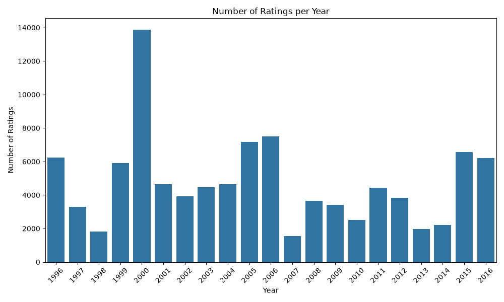

#### 2. User Activity Sparsity & Long-Tail Distribution
Examining the distribution of ratings per user highlights a heavily right-skewed **long-tail phenomenon**:
* **Casual / Novice Users:** The vast majority of users logged between **20 and 50 ratings** (peaking in the `(20, 30]` bin with nearly 100 users).
* **Power Users:** Only a small long-tail subset of active users logged over **300+ ratings**.

This extreme variance directly supports our decision to implement a **Dynamic Sigmoid Weighting System**:
* For low-interaction users (left side of the distribution), collaborative filtering (SVD) lacks sufficient signal, requiring the system to rely heavily on **Content-Based** and **Demographic** filters.
* As a user’s interaction count moves along the tail, the system dynamically scales up the **SVD weight** to provide deeper collaborative personalization.

  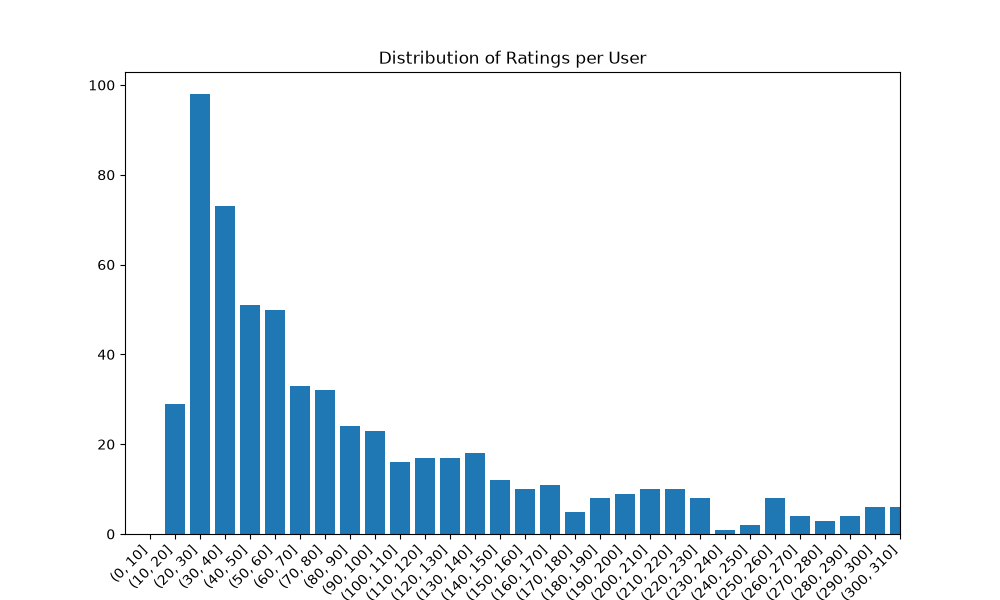

---

## 3. Demographic Filtering Engine

The Demographic Filtering module establishes a non-personalized, global baseline recommendation score for all candidate movies. Its primary purpose is to address the **User Cold-Start Problem** for guest users (*Nu* = 0) or new platform arrivals who lack sufficient rating histories for collaborative filtering.

### 3.1 Mathematical Formulation (IMDb Bayesian Weighted Rating)
Relying strictly on raw vote averages (*R*) introduces severe popularity bias and variance distortion; obscure films with a single 10/10 vote would otherwise rank above critically acclaimed blockbusters. To counteract this, the engine implements a **Bayesian Weighted Rating (*WR*)** formula—the standard algorithm popularized by IMDb:

$$WR = \left( \frac{v}{v + m} \right) R + \left( \frac{m}{v + m} \right) C$$

Where:
* *v*: The total number of votes for the movie (`vote_count`).
* *R*: The average rating of the movie (`vote_average`).
* *C*: The mean vote across the entire dataset (≈ 6.3 - 6.5).
* *m*: The minimum vote threshold required to be listed in the top demographic rankings.

### 3.2 Determining the Vote Cutoff Threshold (*m*)
As illustrated in the *Movie Vote Count vs. Average Rating* scatter plot below, raw vote averages exhibit extreme variance at low vote counts (spanning from 0.0 to 10.0). To filter out unreliable low-vote outliers, a strict threshold was established at the **0.95 quantile (95th percentile)** of vote counts, setting ***m* = 2080 votes** (represented by the red dashed line). 

This threshold acts as a mathematical shrink factor: movies with *v* « *m* are heavily pulled toward the global mean *C*, while movies with high vote counts (*v* » *m*) maintain scores close to their true average rating *R*.

  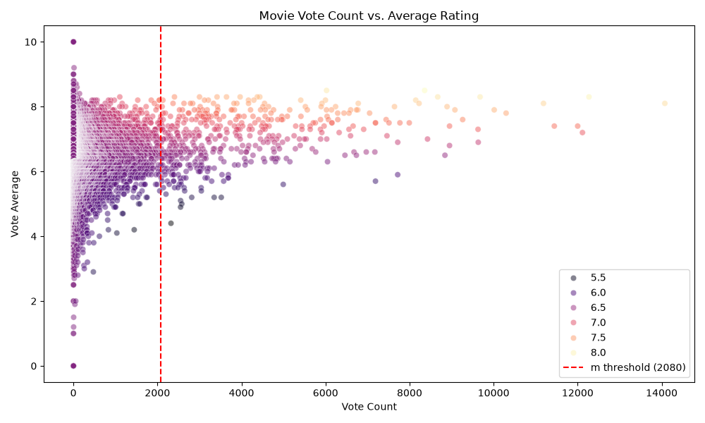

### 3.3 Score Variance Normalization & Shrinkage
The density comparison plots below highlight the stabilizing effect of the Bayesian formula:
* **Raw Vote Average (Red Distribution):** Exhibits a wide, high-variance distribution with heavy tails.
* **Weighted Demographic Score (Blue Distribution):** Normalizes scores into a tight, Gaussian-like distribution centered cleanly around the global average (≈ 6.3 - 6.5). 

This normalization prevents outlier spikes and provides a stable, uniform score scale necessary for blending into the final hybrid ensemble.

  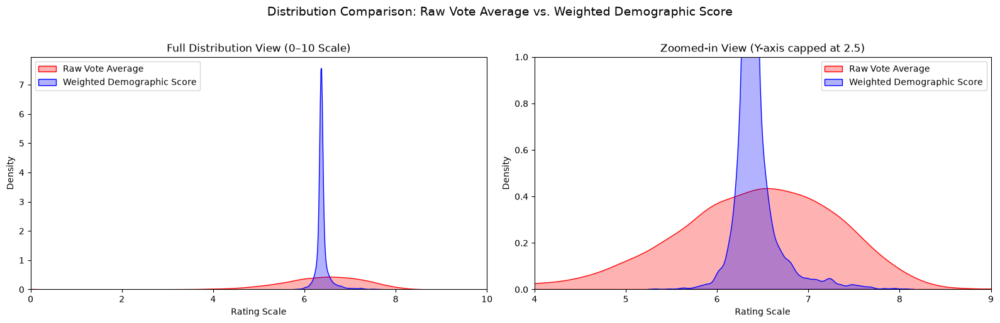

### 3.4 Top Demographic Baseline
Filtering candidates through the weighted formula (*m* = 2080) produces a robust Top-15 universally acclaimed catalog. As shown below, timeless classics such as *The Shawshank Redemption* (≈ 8.07), *The Dark Knight* (≈ 8.02), *Fight Club*, and *The Godfather* top the chart, ensuring high-quality baseline recommendations for cold-start user sessions.

  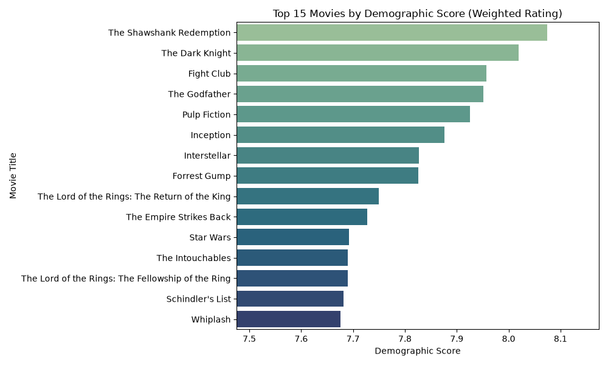

---

## 4. Content-Based Recommendation Engine

The Content-Based Filtering module leverages item metadata to generate recommendations from an input movie (or set of liked movies). Operating independently of user interaction logs, it provides a crucial fallback to resolve the **User Cold-Start Problem**.

### 4.1 Feature Engineering & Vector Representation
To capture semantic plot context alongside categorical metadata, raw text attributes were engineered into two matrix formats:

1. **TF-IDF Vectorization (Overview & Plot Keywords):**  
   Processes unstructured plot overviews and keywords using `TfidfVectorizer` (English stop words removed). It penalizes common vocabulary while boosting rare, domain-specific terms (e.g., *"wormhole"*):
   
   $$\text{TF-IDF}(t, d, D) = \text{TF}(t, d) \times \log\left(\frac{|D|}{|\{d \in D : t \in d\}|}\right)$$

2. **Count Vectorization ("Metadata Soup"):**  
   Categorical attributes (**Genres**, **Cast**, **Director**, **Screenwriters**) were converted into single-token strings (e.g., `ChristopherNolan`) and concatenated into a "metadata soup." A `CountVectorizer` generates binary occurrence matrices, rewarding exact metadata matches without frequency bias.

### 4.2 Genre Imbalance Analysis
An exploratory analysis of top genres reveals significant **class imbalance**:
* **Dominant Genres:** *Drama* (>4,500 titles) and *Comedy* (~3,400 titles) vastly outnumber other categories.
* **Niche Genres:** High-concept categories (*Sci-Fi*, *Fantasy*, *Animation*) comprise fewer than 1,000 titles each.

Relying on genre similarity alone would cause *Drama* and *Comedy* to dominate recommendations. This justifies our multi-feature weighting approach, which pairs genres with keywords, cast, and directors to maintain genre specificity.

  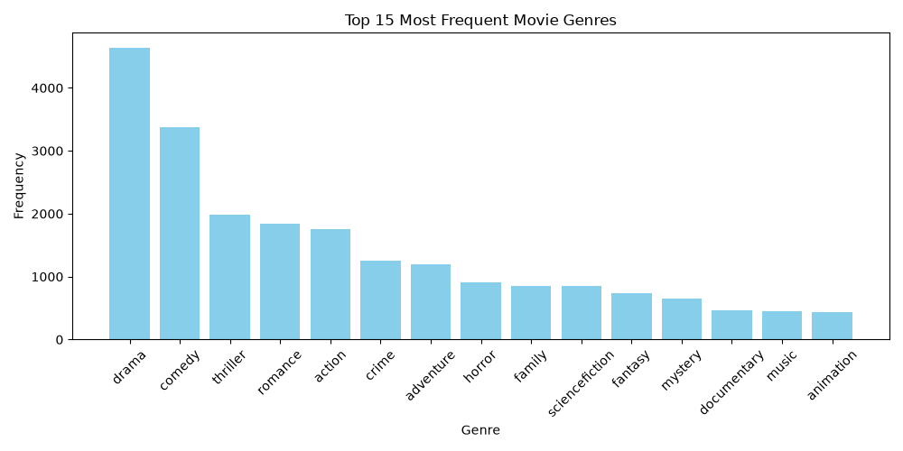

### 4.3 Metadata Latent Space (t-SNE Projection)
To verify the semantic structure of the concatenated embeddings, high-dimensional matrices were projected into 2D space using **t-SNE**:
* **Central Clusters:** *Comedy* (yellow) and *Drama* (orange) form dense central groupings.
* **Distinct Boundaries:** *Horror* (light green) and *Animation* (peach) separate cleanly along outer margins.

This spatial separation confirms that the vector space preserves stylistic boundaries prior to distance calculations.

  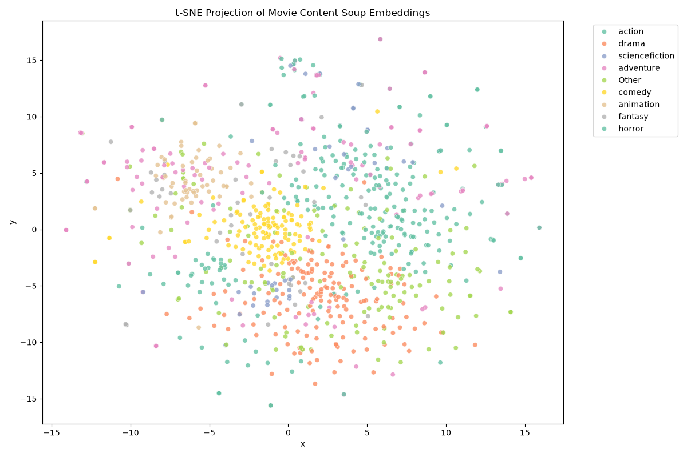

### 4.4 Sub-Module Cosine Similarity Breakdown
Candidate similarity is computed using **Cosine Similarity**:

$$\text{Similarity}(A, B) = \frac{\vec{A} \cdot \vec{B}}{\|\vec{A}\| \|\vec{B}\|}$$

Rather than using a single monolithic score, the engine computes independent cosine matrices across feature dimensions (**Keywords**, **Genres**, **Director**, **Cast**), enabling custom weight tuning.

#### Case Study: Recommendations for *"Interstellar"*
The heatmap below illustrates sub-module contributions for top recommendations of *"Interstellar"*:

* **Director Precision:** *"Inception"* achieves a **1.00 Director similarity** (Christopher Nolan).
* **Genre & Cast Alignment:** *"The Martian"* (**1.00 Genre**, **0.33 Cast**) and *"Contact"* (**0.67 Genre**, **0.33 Cast**) align strongly across hard sci-fi themes and actors.
* **Thematic Consistency:** Sci-fi classics (*"Silent Running"*, *"20,000 Leagues Under the Sea"*) register **1.00 Genre similarity**.

  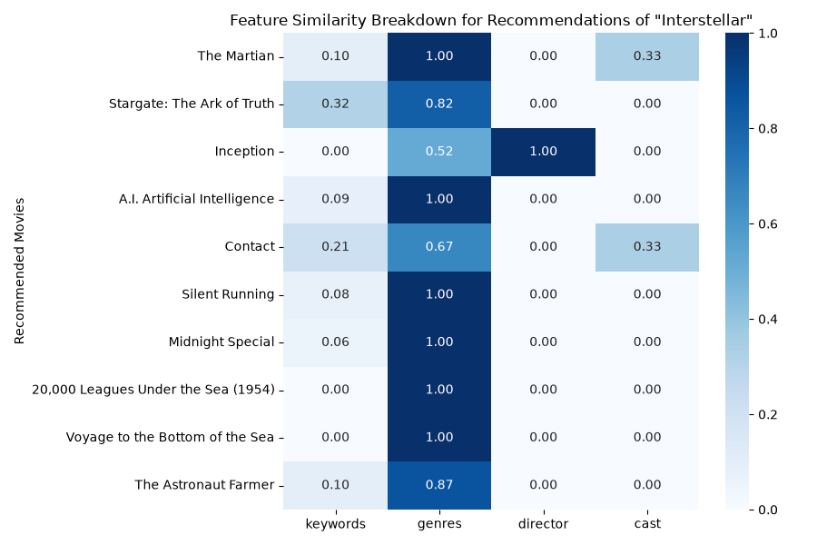

---

## 5. Collaborative Filtering Engine (SVD)

The Collaborative Filtering module predicts individual user preference for unseen items by capturing latent user-item interaction patterns. Using Matrix Factorization via Singular Value Decomposition (SVD), it maps both users and movies into a shared low-dimensional embedding space.

### 5.1 Per-User Temporal Data Split Strategy
To avoid data leakage and mimic real-world deployment where future preferences are predicted from past behavior, a **Per-User Temporal Split** strategy was implemented:

* **Grouping:** Interaction records are grouped individually by `user_id`.
* **Chronological Partitioning:** Each user's rating history is sorted sequentially by timestamp and split into a **0.70 / 0.15 / 0.15** ratio:
  * **Train Set (70%):** Historical ratings used to train latent factor vectors.
  * **Validation Set (15%):** Used for hyperparameter tuning and model selection.
  * **Test Set (15%):** Held-out future interactions reserved for final offline evaluation.

### 5.2 Mathematical Formulation
The SVD model factors the sparse interaction matrix R ∈ ℝU×I into user latent vectors pu ∈ ℝk and item latent vectors qi ∈ ℝk:

$$\hat{r}_{u,i} = \mu + b_u + b_i + p_u^T q_i$$

Where:
* μ: Global average rating.
* bu, bi: User and item baseline bias terms.
* pu, qi: *k*-dimensional user and item feature representations.

The model optimizes the Regularized Mean Squared Error (RMSE):

$$\min_{p, q, b} \sum_{(u,i) \in R_{\text{train}}} \left( r_{u,i} - \hat{r}_{u,i} \right)^2 + \lambda \left( b_u^2 + b_i^2 + \|p_u\|^2 + \|q_i\|^2 \right)$$

### 5.3 Offline Model Evaluation & Top-K Metrics

Top-K recommendation performance (K ∈ {3, 5, 10, 15, 20}) was evaluated using **Precision@K**, **Recall@K**, and **Hit Rate@K** across three experimental setups:

1. **Base SVD (Validation Set):** Provides a benchmark with default hyperparameter values. Achieves **Hit Rate@3 = 0.94**, **Precision@3 = 0.67**, and **Recall@20 = 0.85**.
2. **Tuned SVD (Validation Set):** Hyperparameters were optimized via grid search (adjusting learning rate γ, regularization λ, and latent dimensions *k*). Yields minor performance lifts (**Hit Rate@3 = 0.95**, **Precision@3 = 0.69**, **Recall@20 = 0.86**).
3. **Tuned SVD (Test Set):** Demonstrates strong generalization on unseen future interactions, matching validation performance (**Hit Rate@3 = 0.94**, **Precision@3 = 0.69**, **Recall@20 = 0.87**). Across all configurations, **Hit Rate reaches 1.00 at K ≥ 10**.

#### Base Model vs. Validation Set

  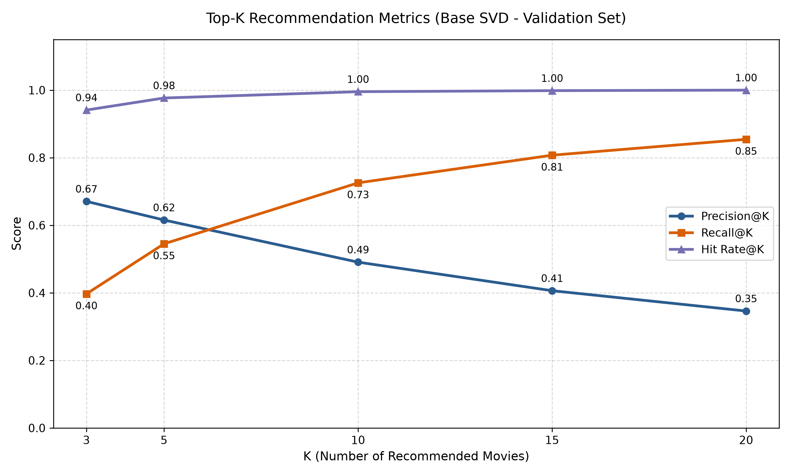

#### Tuned Model vs. Validation Set

  

#### Tuned Model vs. Test Set

  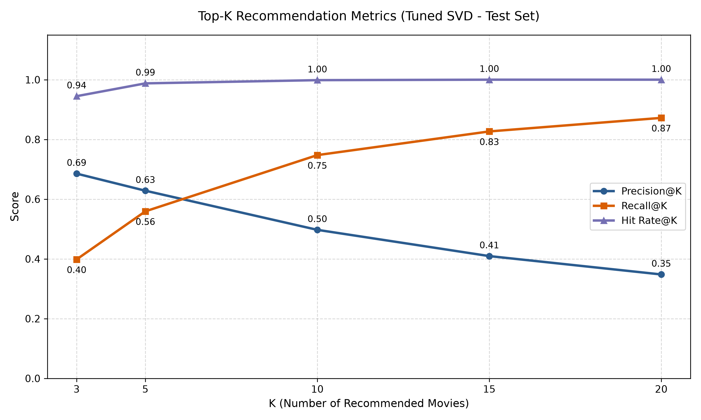

---

## 6. SVD Model Insights

To better understand how Matrix Factorization captures interaction dynamics, internal parameters—including target rating distributions, learned latent embeddings, and baseline bias terms—were analyzed.

### 6.1 Training Set Rating Distribution & Positivity Bias
An inspection of the training interaction set reveals a strong **positivity bias**:

* **Skewed Volume:** Ratings of **4.0** account for the highest volume (>20,000 ratings), followed by **3.0** (~14,000) and **5.0** (>11,000).
* **Sparse Low Ratings:** Critical ratings below **2.0** make up a negligible fraction of total interactions (<2,500 for rating 1.0).

This structural skew indicates users are far more inclined to rate movies they enjoy. SVD leverages this by learning fine-grained latent similarities primarily within high-rating interaction spaces.

  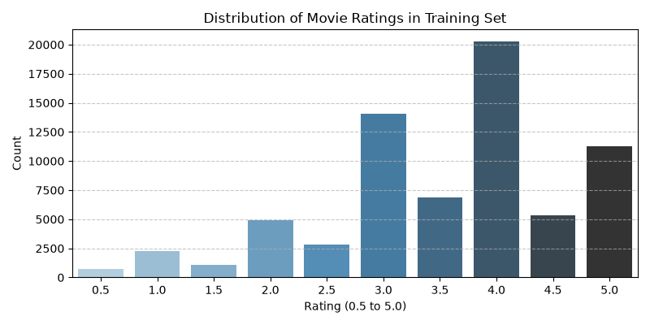

### 6.2 Latent Space Representation (t-SNE Projection)
Projecting item latent vectors qi ∈ ℝk into 2D space via **t-SNE** demonstrates how collaborative filtering groups items based on shared viewer consumption patterns rather than explicit genre labels.

Unlike raw metadata embeddings, SVD groups items by implicit human preference overlap (e.g., cross-genre cult classics or shared fan bases). The continuous, cluster-rich dispersion confirms that matrix factorization captures non-linear affinity structures without collapsing into trivial sub-groups.

  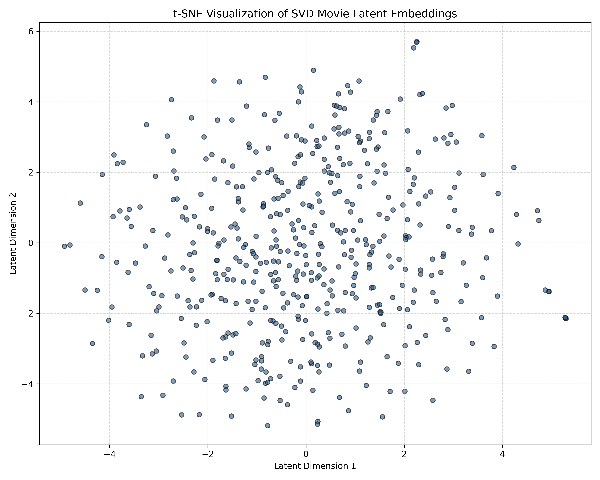

### 6.3 Baseline Bias Decomposition (bu vs. bi)
Decomposing learned bias parameters illuminates user rating habits and intrinsic item quality:

1. **User Bias (bu):** Centered near 0.0 (spanning -2.0 to +1.2). Negative values indicate harsh critics, while positive values denote lenient reviewers.
2. **Item/Movie Bias (bi):** Displays a unimodal distribution centered slightly above 0.0 (spanning -1.8 to +0.8). High positive bi isolates acclaimed blockbusters, while negative bi captures universally panned titles.

By separating baseline user/item tendencies from vector inner products (puT qi), SVD prevents generous users from skewing item quality scores, yielding calibrated recommendations.

  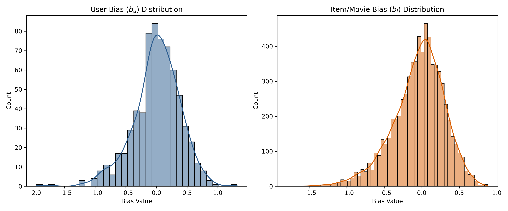

---

## 7. Interactive Web Application & Hybrid Deployment

To demonstrate the real-time capabilities of our hybrid architecture, an [interactive Streamlit web application](https://dynamic-hybrid-movie-recommender-system-a9f86gwfzfhyf4jfbtnlzq.streamlit.app) was developed. It seamlessly integrates the **Demographic**, **Content-Based**, and **Tuned SVD** engines into a unified interface.

### 7.1 Key System Features & Interface Architecture

#### 1. User Identity & Cold-Start Adaptation
* **User Profile Selection:** Log in via existing database IDs (`userId`) or **Guest Mode (`userId = 0`)**.
* **Interaction Counter:** Automatically retrieves historical rating counts (`n_ratings`) for logged-in users.
* **Cold-Start Safeguard:** In Guest Mode, the SVD weight is locked to **0.0**, falling back safely on Demographic and Content models.

#### 2. Dynamic Sigmoid Weight Allocation vs. Manual Custom Tuning
Offers two operational modes for ensemble weighting:
* **Dynamic Sigmoid Curve (Automated):** Computes weights based on user rating count *Nu*:
  
  $$W_{\text{SVD}} = \frac{0.85}{1 + e^{-0.1 \times (N_u - 25)}}$$

  The remaining weight (1 - WSVD) is split between Content-Based (**65%**) and Demographic (**35%**) engines.
* **Manual Slider Controls:** Allows users to adjust top-level engine blend ratios, auto-normalizing values to sum strictly to 1.0.

#### 3. Granular Content-Based Sub-Module Controls
Dedicated sliders allow personalizing metadata similarity matching across six dimensions: **Keywords** (0.25), **Genres** (0.25), **Director** (0.15), **Cast** (0.15), **Collection/Franchise** (0.10), and **Screenplay/Writer** (0.10).

### 7.2 Real-Time Inference & Score Normalization Pipeline
When seed movies are selected, the app executes a 5-step inference pipeline:
1. **Content Similarity:** Computes weighted cosine similarities across feature matrices.
2. **SVD Scoring:** Predicts candidate ratings using the tuned SVD model.
3. **MinMax Normalization:** Scales `demo_score`, `sim_score`, and `svd_score` to [0.0, 1.0].
4. **Weighted Ensemble:** Computes the final aggregated score:

$$\text{Final Score} = w_{\text{demo}} \cdot \hat{S}_{\text{demo}} + w_{\text{content}} \cdot \hat{S}_{\text{content}} + w_{\text{svd}} \cdot \hat{S}_{\text{svd}}$$

5. **Filtering & Display:** Filters out seed movies and renders the ranked Top-N recommendations.

### 7.3 Performance Optimization & Fragment Caching
To maintain sub-100ms UI response times, two optimizations were applied:
* **Asset Caching (`@st.cache_resource`):** Pre-loads matrices and SVD models into memory at runtime to eliminate redundant file I/O.
* **Isolated UI Rendering (`@st.fragment`):** Isolates slider and input controls to prevent full-page re-renders during UI tweaks.

---

## 8. Conclusion

This project successfully developed an end-to-end hybrid movie recommendation system that bridges the gap between cold-start generalization and high-precision personalization. By combining **Bayesian Weighted Demographic Ratings**, **Multi-feature Cosine Content Filtering**, and **Tuned SVD Matrix Factorization**, the system overcomes individual model limitations. 

Key achievements include:
* **Cold-Start Resilience:** Seamless transition between guest users and power users via a **Dynamic Sigmoid Weighting System**.
* **High Predictive Performance:** The tuned SVD collaborative engine achieves a **0.94+ Hit Rate@3** and **1.00 Hit Rate@10** on temporal test splits.
* **Interactive Deployment:** An optimized Streamlit application delivering real-time, customizable recommendations under flexible user constraints.

---

## 9. Acknowledgments

We express our gratitude to the open-source community and data providers that made this project possible:
* **Dataset & Metadata:** TMDB (The Movie Database) and GroupLens (MovieLens) for providing comprehensive metadata and interaction logs.
* **Core Libraries:** The developers behind `scikit-learn`, `Surprise` (SVD implementation), `pandas`, and `NumPy` for robust modeling tools.
* **Deployment Framework:** Streamlit for enabling seamless interactive UI creation and model visualization.